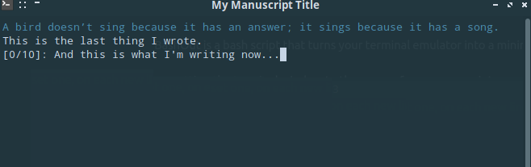

= Forwords CLI Version

Forwords provides a simple Bash script designed to help you focus on writing by providing a clean interface and tracking your word count. It offers inspirational banners, notes, and style prompts to get your creative juices flowing.

== Installation and Setup

1. Fork and clone this repository.

2. Make the script executable:
[source,bash]
----
chmod +x forwords.sh
----

== Usage

Run the script:
[source,bash]
----
./forwords.sh
----

The script will automatically use your configured banner style from `~/Forwords/.forwords.config`. If no configuration file exists, it will use the default settings.

== Banner Styles

The script supports three banner styles, configured via the `DEFAULT_BANNER` setting in your config file:

1. *Quote* (`DEFAULT_BANNER: Quote`): Displays a random quote from `~/Forwords/Resources/quotes.txt`. Feel free to add more quotes to this file.

2. *Note* (`DEFAULT_BANNER: Note`): Displays a custom message from `~/Forwords/Resources/note.txt`. Create this file with your personal message.

3. *Prompt* (`DEFAULT_BANNER: Prompt`): Generates a random writing style prompt. For example:
[source,bash]
----
Write a light-hearted mystery story set in a urban environment. Use a conversational voice with steadily pacing in present-tense from a first-person perspective.
----

[NOTE]
====
If the required resource files are missing, the script will display helpful messages about creating them.
====

== Writing Interface

While in the writing interface, the script:

1. Clears the screen.
2. Displays the chosen banner.
3. Displays the last sentence you wrote (if any).
4. Shows your session and total word counts.
5. Prompts you for a new sentence.

== Writing Text

1. Type (and edit) your text as you normally would.

2. When you finish a line or a paragraph, press the `[Enter]` key. The script will:
   * Clear your text from the interface.
   * Save it to your configured manuscript file.
   * Update the last sentence display with the latest entry.
   * Increment the total and session word counts appropriately.

3. The interface will be clear and ready for further text to be typed.

4. To exit the script, press `Ctrl+C`. Be sure to hit `[Enter]` before you do to save your latest input.

== Configuration

Forwords uses a shared configuration file at `~/Forwords/.forwords.config`. See the link:configuration.adoc[Configuration Guide] for detailed information about all available settings.

== Customization

All customization is done through the configuration file `~/Forwords/.forwords.config`:

Banner Style:: Change `DEFAULT_BANNER` to `Quote`, `Note`, or `Prompt`
Banner Color:: Change `BANNER_COLOR` to `blue`, `red`, `green`, `yellow`, `magenta`, `cyan`, or `white`
Save Location:: Change `SAVE_FILE` to save your writing to a different location
Custom Banners:: Add your own quotes to `~/Forwords/Resources/quotes.txt` or create a custom note in `~/Forwords/Resources/note.txt`

== Requirements

* Bash shell
* Basic Unix utilities (wc, sort, etc.) 