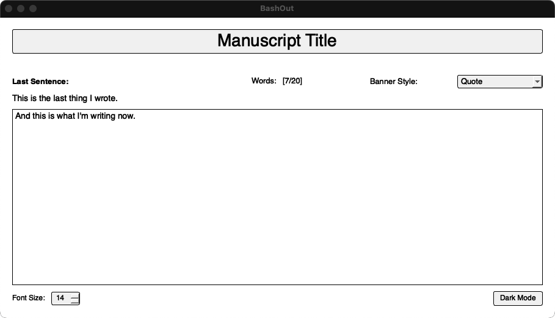
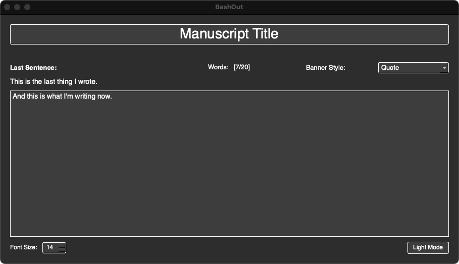

= Forwords GUI Version

Forwords provides a cross-platform PyQt5-based desktop application designed to help you focus on writing by providing a clean, distraction-free interface and tracking your word count.

== Installation and Setup

1. Fork and clone this repository.

2. Install the required dependency:
[source,bash]
----
pip install PyQt5
----

== Usage

Run the application:
[source,bash]
----
python3 forwords.py
----

The GUI will automatically use your configured settings from `~/Forwords/.forwords.config`. If no configuration file exists, it will use the default settings.

== Features

The GUI version provides a truly distraction-free writing environment with:

Minimal interface:: Only essential controls (theme, font size, word count)
Configuration-driven:: All settings controlled via `~/Forwords/.forwords.config` file
No manuscript management:: Manuscript file is set in `.forwords.config` and cannot be changed from GUI
Real-time word counting:: Session and total word counts
Theme support:: Light and dark themes (saved to config)
Keyboard shortcuts:: Enter (save sentence)

== Banner Styles

The GUI supports three banner styles, controlled by the `DEFAULT_BANNER` setting in your config file:

Quote:: (`DEFAULT_BANNER: Quote`) Displays random writing quotes from `~/Forwords/Resources/quotes.txt`

Note:: (`DEFAULT_BANNER: Note`) Displays a custom message from `~/Forwords/Resources/note.txt` (create this file manually)

Prompt:: (`DEFAULT_BANNER: Prompt`) Generates random writing prompts

== Writing Interface

The writing interface is designed to be completely distraction-free:

1. *Banner display* - Shows your configured banner at the top
2. *Last sentence* - Displays the last sentence you wrote (if any)
3. *Word counts* - Shows session and total word counts
4. *Text input* - Clean input area for your next sentence
5. *Controls* - Minimal theme and font size controls

== Controls

=== Theme Control
Light/Dark toggle:: Switch between light and dark themes
Changes are automatically saved to your config file

=== Font Size Control
Slider:: Adjust font size from 8 to 24 points
Changes are automatically saved to your config file

=== Writing
Enter key:: Save the current sentence and clear the input
Text editing:: Normal text editing works as expected

== Configuration

All settings are controlled through the `~/Forwords/.forwords.config` file:

SAVE_FILE:: Path to your manuscript file
BANNER_COLOR:: Banner color (blue, red, green, yellow, magenta, cyan, white)
DEFAULT_BANNER:: Banner style (Quote, Note, Prompt)
GUI_THEME:: Theme (light, dark) - can be changed in GUI
GUI_FONT_SIZE:: Font size (8-24) - can be changed in GUI

== Requirements

* Python 3.6+
* PyQt5
* Cross-platform (macOS, Windows, Linux) 